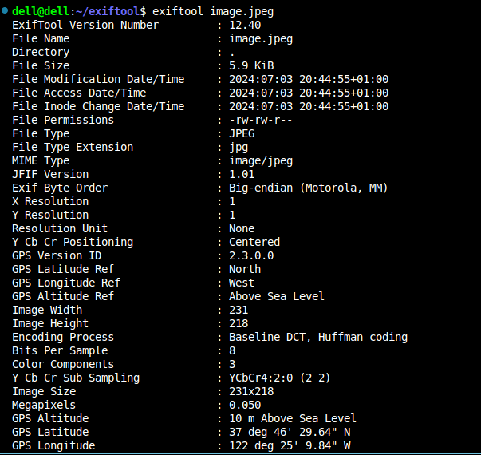
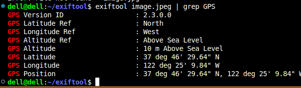
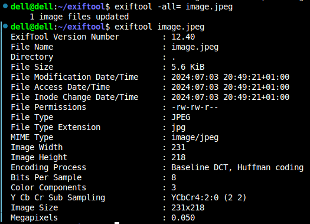

## What is EXiftool ?

Exiftool is a powerful and flexible command-line application for reading, writing, and editing metadata in a wide variety of file types, primarily images. It is developed by Phil Harvey and is widely used for manipulating metadata in digital photos. exiftool can handle a wide range of metadata formats, including EXIF, IPTC, XMP, and many others.

# Extracted data from the picture

# GPS data 

# To delete all the GPS data from a picture use the command 
 'exiftool -all= picture.png'
 

